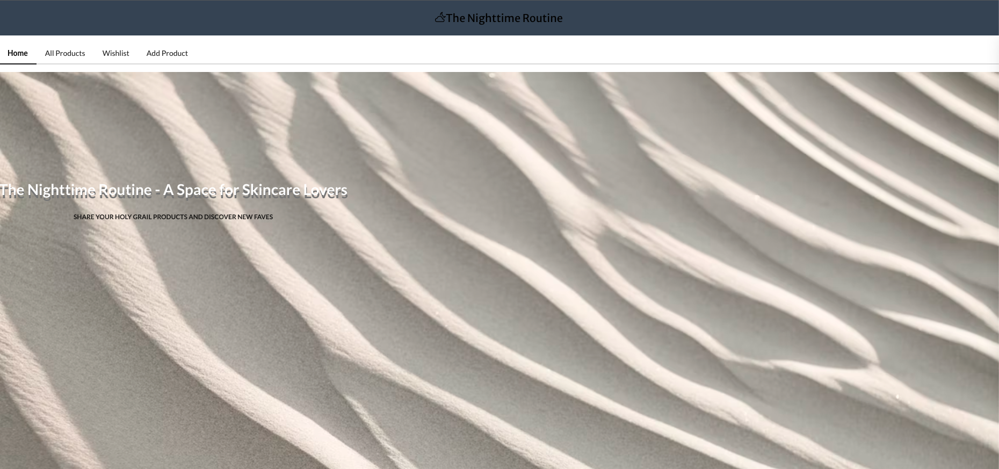
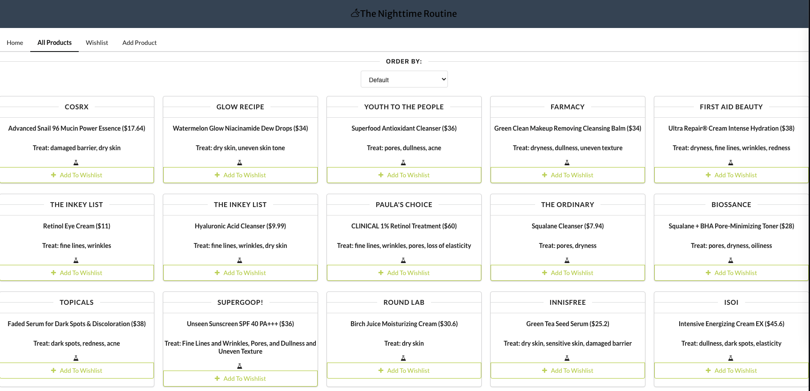
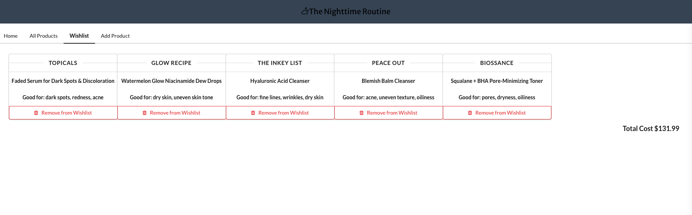
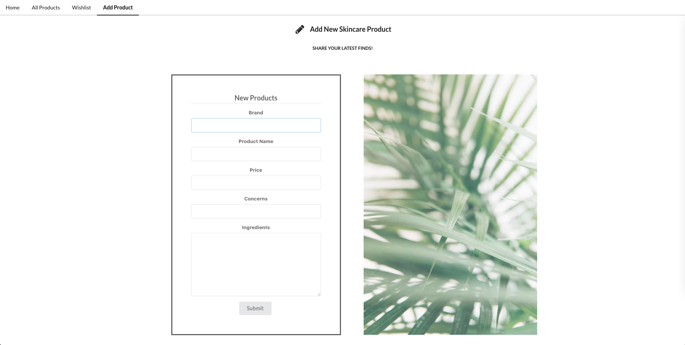

# The Nighttime Routine 
The Nighttime Routine is a space for skincare lovers to find and share products and plan future purchases with their own wishlist. This application's backend was built with Ruby and ActiveRecord. After cloning, the backend can be launched by running `rake db:migrate` to set up the database, `rake db:seed` to install some initial seed data, `bundle install` to install necessary gems, and finally `bundle exec rake server` to launch the server.

## Frontend
This application's frontend was built with HTML, Javascript, React, CSS, and Semantic UI. After cloning, the frontend can be launched by running `npm install` to install necessary dependencies and `npm start` to launch the frontend server. 

## User Stories
Users are able to scroll (and sort) through various skincare products and view the product names, brands, prices, ingredients, claims/treatment concerns. Users are able to save these products to a wishlist and view the total price of their wishlist in order to plan for future purchases. Users are also able to add new products to the main product list. 

## Walkthrough Snapshots

### Homepage: 

### Product List:

### Wishlist:

### Add New Product: 

## Created By
Hannah Glazier:

Gitbub: https://github.com/HannahGlazier

LinkedIn: https://www.linkedin.com/in/hannah-glazier-3a214a231/